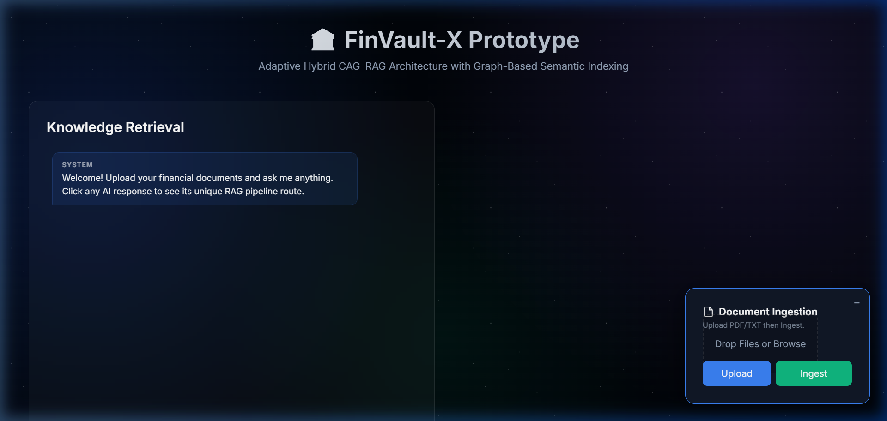
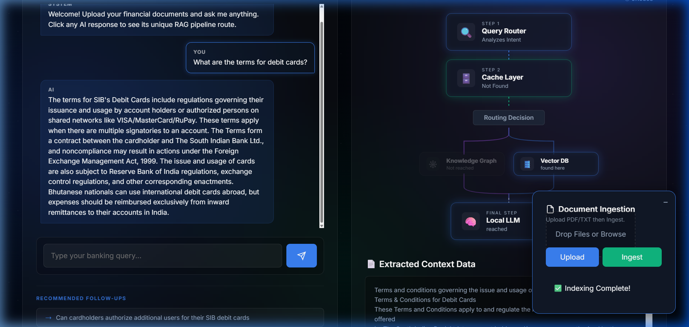
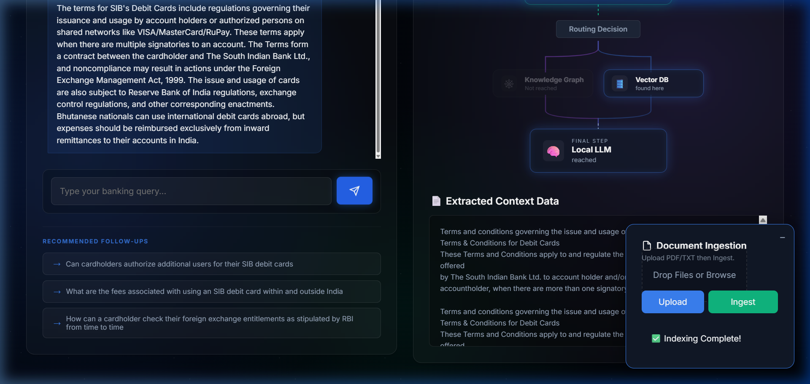
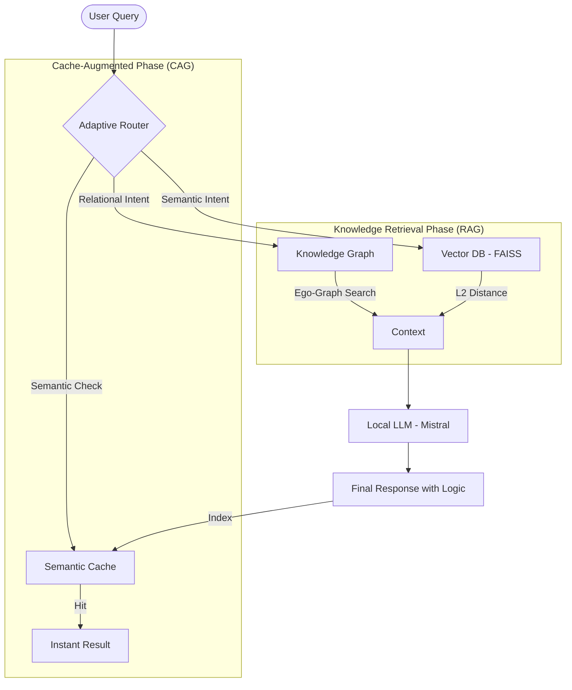

# FinVault-X: The Future of Adaptive Hybrid CAG-RAG Systems

   

**FinVault-X** is an industrial-grade banking knowledge retrieval system prototype. Unlike traditional RAG (Retrieval-Augmented Generation) systems that rely on a single vector store, FinVault-X implements a **Hybrid AI Strategy** combining **Vector Databases (FAISS)**, **Knowledge Graphs (NetworkX)**, and a high-speed **Semantic Cache (CAG)** controlled by an **Adaptive Query Router**.

---

## ✨ UI Showcase: The Premium Experience

| **Landing Page** | **Retrieval Pipeline** |
| :---: | :---: |
|  |  |

| **Adaptive Flowchart** | **Document Ingestion** |
| :---: | :---: |
|  |  |

---

## 🏗️ Visual Architecture



---

## ⚡ Core Innovations

### 1. Hybrid Retrieval: Graph vs. Vector
The system doesn't just "search" - it "reasons."
- **Vector Store (FAISS):** Ideal for general semantic questions. It captures the spirit of the text using embeddings.
- **Knowledge Graph (NetworkX):** Ideal for complex relationship queries (e.g., "How does regulation X impact bank Y?"). It maps explicit entities and their intersections using spaCy-powered triple extraction.

### 2. Cache-Augmented Generation (CAG)
To minimize local LLM latency, FinVault-X uses a **Semantic Cache**. Instead of exact string matching, it performs vector similarity checks on past queries. If a new query is semantically equivalent to a previous one (>= 0.85 cosine similarity), the system returns the cached answer in **milliseconds**, completely bypassing the local GPU/CPU inference.

### 3. Adaptive Query Routing
An NLP-based heuristic engine analyzes incoming queries to determine the most cost-effective retrieval path. It looks for linguistic markers indicating whether a relational (Graph) or semantic (Vector) search is required.

---

## 🛠️ Tech Stack & Library Deep-Dive

The project is built on a 100% local-first, free-to-run stack.

| Category | Component | Purpose |
| :--- | :--- | :--- |
| **Logic & UI Server** | **FastAPI** | High-performance asynchronous backbone serving both API and the premium UI. |
| **User Interface** | **Vanilla HTML/CSS/JS** | Custom Glassmorphism dashboard with real-time pipeline status tracking. |
| **Vector Index** | **FAISS (L2)** | Ultra-fast in-memory similarity search for high-dimensional document vectors. |
| **Knowledge Store** | **NetworkX** | Directed Graph implementation for multi-hop entity relationship retrieval. |
| **Linguistic Logic** | **spaCy** | Entity extraction (`ORG`, `PRODUCT`, `MONEY`, `LAW`) used for graph synthesis. |
| **Embeddings** | **all-MiniLM-L6-v2** | Lightweight and accurate 384-dim vector model for RAG and Cache. |
| **Generation Engine** | **Ollama (Mistral)** | Local-only LLM inference ensuring Zero-API costs and 100% Data Privacy. |
| **Process Control** | **LangChain** | Orchestrating prompts and context merging logic. |
| **Document Loader** | **PyPDF / Tika** | Efficient text extraction from complex financial PDF reports. |

---

## 📂 Project Ecosystem

- **`main.py`**: The central brain. Unified FastAPI server managing the lifecycle of models and routing.
- **`ingestion/`**: Orchestrates PDF reading and **Semantic Chunking** (aware of paragraph breaks and metadata).
- **`retrieval/`**: Manages the FAISS index and L2 distance-based searching.
- **`graph/`**: The entity-relationship engine using spaCy to extract "facts" into Directed Graphs.
- **`cache/`**: The CAG implementation using `scikit-learn` for semantic equivalence checks.
- **`ui/`**: A premium, state-of-the-art web interface built for high-touch user experiences.
- **`utils/`**: Evaluation metrics tracking latency, token overlap, and system health.

---

## 🚀 Getting Started (Installation & Setup)

### 1. Repository Setup
Clone the project and initialize the environment:
```bash
# Create Virtual Env
python -m venv venv

# Activate (Windows)
.\venv\Scripts\activate

# Activate (macOS/Linux)
source venv/bin/activate

# Install Core Libraries
pip install -r requirements.txt
python -m spacy download en_core_web_sm
```

### 2. LLM Configuration (Ollama)
FinVault-X requires **Ollama** installed on your system.
1. Download from [ollama.com](https://ollama.com).
2. Fetch the model:
   ```bash
   ollama pull mistral
   ```

### 3. Operationalizing the App
Start the unified server with a single command:
```bash
python main.py
```
> **Access the Dashboard:** [http://localhost:8000](http://localhost:8000)

---

## 📊 How to Use the FinVault-X Interface

1. **Phase 1: Ingestion**
   - Click "Drop Files or Browse" to upload your banking policy PDFs.
   - Click **Upload** to move them into the `data/` directory.
   - Click **Ingest** to trigger the triple-indexing (Vector, Graph, and Cache refresh).

2. **Phase 2: Discovery**
   - Type queries in the Knowledge Retrieval box.
   - **Observe the Flowchart:** The UI updates in real-time showing which "Route" was taken.
   - **Inspect Context:** See exactly what raw data the Model used to generate its answer in the context viewer.

3. **Phase 3: Optimization**
   - Ask identical or similar questions to witness **CAG (Cache-Augmented Generation)** in action, returning results in `< 0.010s`.

---

## 🎯 Benchmark Tracking
FinVault-X tracks performance via `EvaluationMetrics`:
- **Retrieval Accuracy:** Token overlap checking between retrieved context and ground truth.
- **System Latency:** End-to-end response time measurement.
- **Route Efficiency:** Tracking the ratio of Cache Hits vs. LLM Generations.

---

## 📜 Roadmap & Vision
- [ ] Multi-Modal Ingestion (Charts & Images scanning).
- [ ] Federated RAG (Scaling across multiple local machines).
- [ ] Advanced GraphDB integration (Neo4j support for industrial scale).

---

## 🛡️ License
Distributed under the MIT License. "Local-First AI for Enterprise Security."


